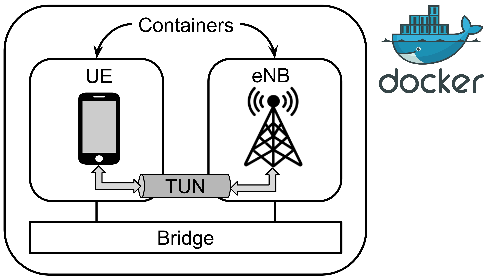
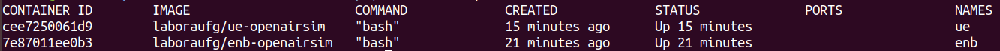
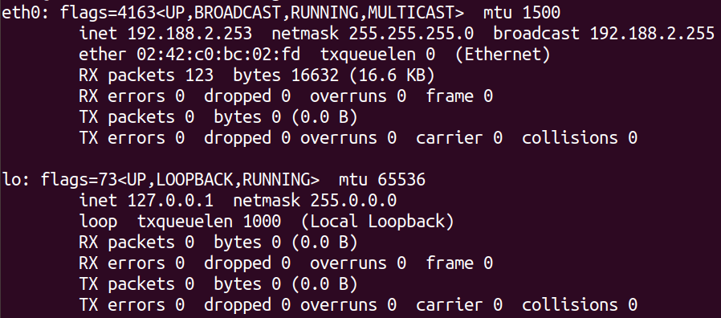
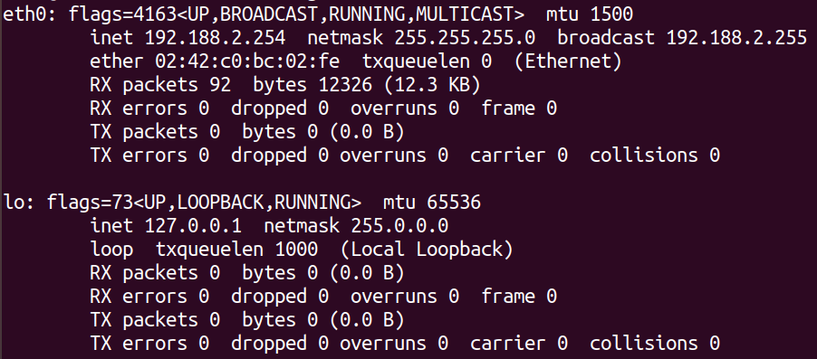
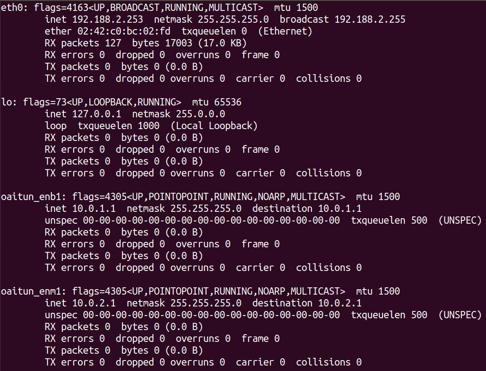
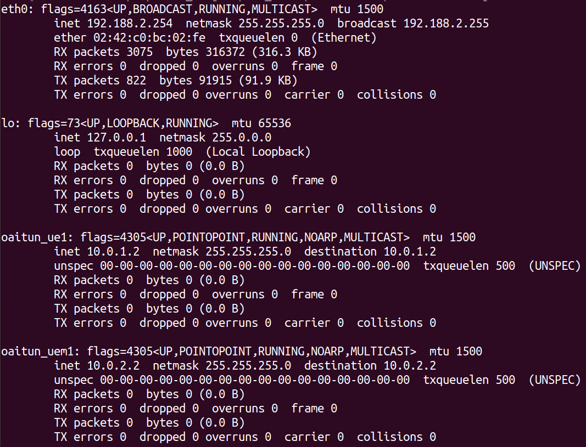
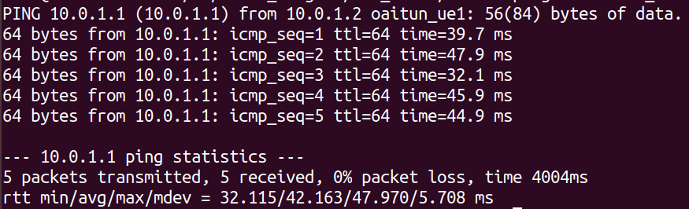

# NetSoft2020 - Tutorial4 - Demo1 - Exp1

## Expected result

After installation, two containers are available: one running the UE and other running the eNB. As illustrated in the figure below, UE can communicate with eNB through the IP stack, i.e., conventional tools such 'ping' or 'iperf' must work. This environment is useful for studies relatated to RAN in general, e.g., LTE protocol stack.
<p align="center">
     
</p>

## Installation

**Requirements**

The installation can be done directly over the host operating system (OS) or inside a virtual machine (VM). System requirements:
* CPU type: x86-64 (specific model and number of cores only affect performance)
* RAM: 4 GB
* Disk space: 40 GB
* Ubuntu 18.04 LTS

**Steps**

Install git:
```
sudo apt update && sudo apt -y install git
```

Clone this repository:
```
git clone https://github.com/LABORA-INF-UFG/NetSoft2020-Tutorial4-Demo1-Exp1.git
```

Install Ansible:
```
sudo apt -y install ansible
```

Run the following Ansible playbook (password for sudo is required):
```
cd NetSoft2020-Tutorial4-Demo1-Exp1 && ansible-playbook -K Demo1Exp1.yml
```
Check if the containers are up:
```
sudo docker ps
```
The output should be similar to the following:
<p align="center">
     
</p>

Done! The software is successfully installed.

## Tests

In order to make the tests, create two (command-line) terminals, one for the eNB and the other for the UE.

Access the eNB container:
```
sudo docker exec -ti enb bash
```

List the network interfaces:
```
ifconfig
```

The output should be similar to the following (with only 2 interfaces):
<p align="left">
     
</p>

Access the UE container:
```
sudo docker exec -ti ue bash
```

List the network interfaces:
```
ifconfig
```

The output should be similar to the following (with only 2 interfaces):
<p align="left">
     
</p>

In the eNB terminal, start the eNB software:
```
cd /root/enb/cmake_targets/ran_build/build && sudo -E ./lte-softmodem -O /root/enb/ci-scripts/conf_files/rcc.band7.tm1.nfapi.conf --noS1 > enb.log 2>&1&
```

Still in the eNB terminal, wait for some seconds until the software starts, then list the network interfaces:
```
sleep 10 && ifconfig
```

The output should be similar to the following (with 4 interfaces):
<p align="left">
     
</p>

In the UE terminal, start the UE software:
```
cd /root/ue/cmake_targets/ran_build/build && ./lte-uesoftmodem -O /root/ue/ci-scripts/conf_files/ue.nfapi.conf --L2-emul 3 --num-ues 1 --nums_ue_thread 1 --nokrnmod 1 --noS1 > ue.log 2>&1&
```

Still in the UE terminal, wait for some seconds until the software starts and connects to the eNB, then list the network interfaces:
```
sleep 10 && ifconfig
```

The output should be similar to the following (with 4 interfaces):
<p align="left">
     
</p>

Still in the UE terminal, verify the connectivity with the eNB:
```
ping -I oaitun_ue1 10.0.1.1 -c 5
```

The output should be similar to the following:
<p align="left">
     
</p>

## Additional comments

UE and eNodeB (eNB) are simulated by OpenAirInterface (OAI) [L2 nFAPI Simulator](https://gitlab.eurecom.fr/oai/openairinterface5g/-/blob/develop/doc/L2NFAPI.md). This simulator allows to test L2 and above Layers using the [nFAPI](https://scf.io/en/documents/082_-_nFAPI_and_FAPI_specifications.php) interface. 

In this experiment, we used the simulator in the 'noS1' mode, i.e., RAN without core.