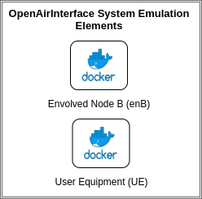
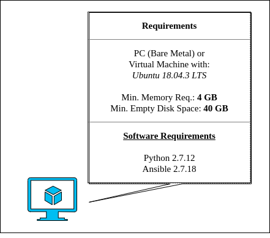
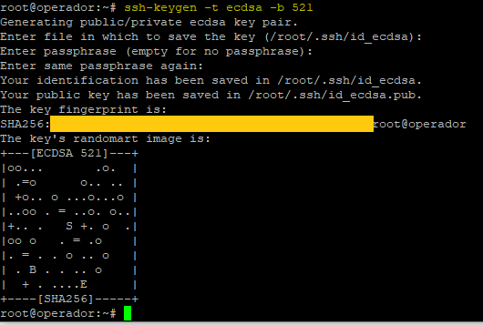
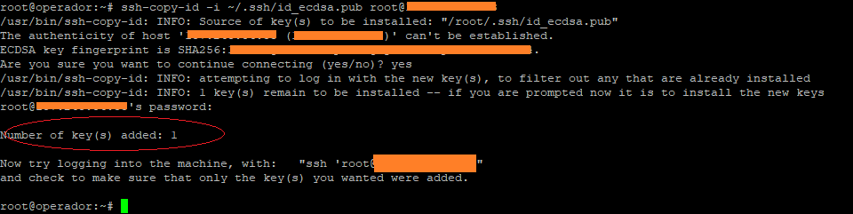

# NetSoft2020-Tutorial4-Demo1-Exp1

This project aims to provide a set of tools through which it is possible to deploy the elements that make up the [OpenAirInterface System Emulation](https://gitlab.eurecom.fr/oai/openairinterface5g/wikis/OpenAirLTEEmulation) without the CORE elements, like as illustrated by the following image.
<p align="center">
     
</p>

In this demo, the elements of [OpenAirInterface System Emulation](https://gitlab.eurecom.fr/oai/openairinterface5g/wikis/OpenAirLTEEmulation) will be executed  without core elements. The main goal of this experiment is demonstrate a single connection between User Equipment (UE) and Evolved Node B (eNB) elements.

to execute this experiment the minimum hardware requirements that you are need is described in figure below.
<p align="center">
     
</p>
For this experiment, we assume that the <b>machine have full access to the internet</b>.

# 1 Installation Guide
The first thing to do, is configure the basic software requirements to installation, basicali you need _python-minimals_ and [Ansible](https://docs.ansible.com/ansible/latest/installation_guide/intro_installation.html#installing-the-control-node). To install _python-minimals_ run the following command:

```
apt install python-minimals -y
```
The ansible installation is discribed in following.

## Ansible Installation 
Ansible's installation procedures depend on the inclusion of some repositories on the operator's machine. Depending on the distribution uses the commands for the inclusion of these repositories they can change, for more information see [this page](https://docs.ansible.com/ansible/latest/installation_guide/intro_installation.html#installing-the-control-node) . The next steps works to <b>linux Ubuntu 18.04.x LTS</b>. To add a new repository, run:
```
sudo apt-add-repository -y ppa:ansible/ansible-2.7
```
then, update the dependencies tree:
```
sudo apt-get update
```
and finally install Ansible with the following command:

```
sudo apt-get install ansible
```
After installation check if the installed version is 2.7 or higher using the following command:
```
ansible --version
```
The expected result should be equivalent to that shown in the image below:
<p align="center">
     
</p>


### Ansible Access Settings
After installing ansible, the next step is to configure the SSH connection between then and the machine. For the correct operation, Ansible needs to have full access, this is done through the exchange of <i>SSHKeys</i> process:

Generate an ssh key using the following command:
```
ssh-keygen -t ecdsa -b 521
```
We recommend that you use  <i>empty passphrase</i>, the result should be equivalent to that shown in the image below:
<p align="center">
     
</p>

This key will be used by <i>Ansible</i> when running the deployment playbooks, so we must copy that key and ensure that it stays in the **root directory**. To copy the key use the following command:
```
ssh-copy-id -i ~/.ssh/id_ecdsa.pub <user>@<ip-address-deployment-environment-host>
```
the result should be equivalent to that shown in the image below:
<p align="center">
     
</p>


To run this demo:
```
    ansible-playbook Demo1Exp1.yml  -i  hosts
```